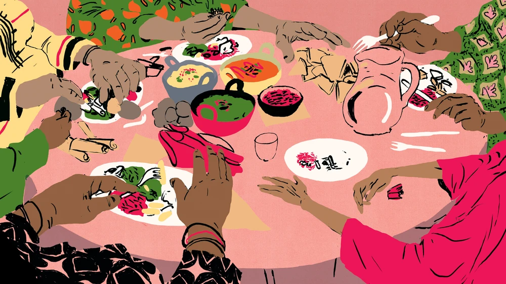

  
```{r setup, include=FALSE}
library(flexdashboard)
library(tidyverse)
library(haven)
library(lm.beta)
library(rstatix)
library(colorspace)
library(ggrepel)
library(plotly)
library(colorblindr)

#library(ragg)

#knitr::opts_chunk$set(dev= "ragg_png")
```


Sidebar {.sidebar}
=====================================


**Data Source**


Access to these data provided by Inter-university Consortium for Political and Social Research (ICPSR).      
Additional details on methodology can be found at the [ICPSR website](https://www.icpsr.umich.edu/web/ICPSR/series/39) and the [CDC website](https://wwwn.cdc.gov/nchs/nhanes/Default.aspx).


**Analytics**


Plots produced using R's `ggplot`and `shiny` packages. Dashboard produced using R's `flexdashboard` package as part of `Rmarkdown`.


Background
=========================

```{r picture, echo = F, out.width = '100%'}

```


Row {data-width=1000}
-----------------------------------------------------------------------
### __Disordered Eating: An Epidemic in the United States__

The data for these visualizations were derived from the National Health and Nutrition Examination Surveys (2005-2015). The National Health and Nutrition Examination Survey (NHANES) is a program of studies designed to assess the health and nutritional status of adults and children in the United States. The survey combines interviews and physical examinations. NHANES is a major program of the National Center for Health Statistics (NCHS); NCHS is part of the Centers for Disease Control and Prevention (CDC). Data regarding disordered eating behaviors were derived from interview questions asking adult participants if they had sought weight loss within the last year. Response options were "Yes" or "No". Positive responses were qualified by methods used to lose weight, with engagement in a particular disordered eating behavior coded as "1" and non-engagement as "0". 

Row {data-width=1000}
-----------------------------------------------------------------------

### References

Becker, C. B., Middlemass, K., Taylor, B., Johnson, C., & Gomez, F. (2017). Food insecurity and eating disorder pathology. _The International Journal of Eating Disorders_, _50_(9), 1031–1040. https://doi.org/10.1002/eat.22735    

Friel, S., & Ford, L. (2015). Systems, food security and human health. _Food Security_, 7, 437–451. https://doi.org/10.1007/s12571-015-0433-1     

United States Department of Health and Human Services. Centers for Disease Control and Prevention. National Center for Health Statistics. National Health and Nutrition Examination Survey (NHANES), 2007-2008. Ann Arbor, MI: Inter-university Consortium for Political and Social Research [distributor], 2012-02-22. https://doi.org/10.3886/ICPSR25505.v3           

Vartanian, L. (2012). Self-Discrepancy Theory and Body Image. _Encyclopedia of Body Image and Human Appearance_, 2, 711–717. https://doi.org/10.1016/B978-0-12-384925-0.00112-7        


Body Image
=========================


Row {data-width=650}
-----------------------------------------------------------------------

### Final Visual

```{r plot1,results=FALSE,warning=FALSE,message=FALSE}
#dataprep
weight2011 <- here::here("data", "2011_weight_history.XPT") %>%
  read_xpt()

dep2011 <-  here::here("data", "2011_depression_screener.XPT") %>%
  read_xpt()

demo2011 <- here::here("data", "2011_demographics.XPT") %>%
  read_xpt()

dep1 <- left_join(weight2011,dep2011)
dep <- left_join(dep1, demo2011)

#removing "refuse to answer"
dep <- dep %>%
  filter((WHD020 != 7777 & WHD020 != 9999), 
         (WHD045 != 77777 & WHD045 != 99999))

#new variables: depression mean 

dep <- dep %>%
  rowwise() %>%
  mutate(dpq = sum(c(DPQ010, DPQ020, DPQ030, DPQ040, DPQ050,
                        DPQ060, DPQ070, DPQ080,DPQ090, DPQ100)))%>%
  drop_na(dpq)


#actual-ideal weight discrepency variable
dep <- dep %>%
  mutate(dif_weight = WHD045 - WHD020)


#removing men 
dep_filtered <- dep %>%
  filter(RIAGENDR == 2,
         dif_weight <=0)%>%
  mutate(mean_dpq = mean(dpq)) %>%
  select(RIAGENDR,dif_weight,mean_dpq, SEQN, dpq)


#creating factor variable for actual-ideal weight

dep$dif_weight_fct <-Hmisc::cut2(dep$dif_weight,c(-125,-100, -75,
                                                  -50, -25))

dep$dif_weight_fct <- as.factor(dep$dif_weight_fct)


#renaming levels
dep_lev <- dep %>%
  mutate(dif_weight_fct = fct_recode(dif_weight_fct, 
                  "More than\n125 lbs" = "[-240,-125)", 
                  "100-125" = "[-125,-100)",
                  "75-100" = "[-100, -75)",
                  "50-75" = "[ -75, -50)",
                  "25-50" = "[ -50, -25)",
                  "0-25" = "[ -25, 100]"))

#mean by factor
plot1_df <-dep_lev %>%
  group_by(dif_weight_fct) %>%
  summarise(group_dpq = mean(dpq),
            group_se = sd(dpq)/sqrt(n()))

#removing unnecessary data
rm(demo2011, dep, dep_lev,dep1,dep2011,weight2011)
gc()

####FINAL VISUALIZATION###
plot1_df %>%
  ggplot(aes(group_dpq, dif_weight_fct)) +
  geom_errorbarh(aes(xmin =  group_dpq - 1.96*group_se,
     xmax = group_dpq+ 1.96*group_se),
     color = "thistle",
     height = .2) +
  geom_errorbarh(aes(xmin = group_dpq + qnorm(.025)*group_se,
                    xmax = group_dpq + qnorm(.975)*group_se),
                color = "cyan4",
                height = 0.2,
                size = 0.5) + 
  geom_errorbarh(aes(xmin = group_dpq + qnorm(.05)*group_se,
                    xmax = group_dpq + qnorm(.95)*group_se),
                color = lighten("magenta4", .1),
                height = 0.2,
                size = 0.8) + 
  geom_errorbarh(aes(xmin = group_dpq + qnorm(.1)*group_se,
                    xmax = group_dpq + qnorm(.9)*group_se),
                color = "darkolivegreen3",
                height = 0.2,
                size = 1.1) +
  geom_point() +
  labs(x = "Average Depressive Symptomology",
         y = "Desired Weight Loss Goal (in pounds)",
       title = "Depressive Symptoms in Women",
       subtitle = "According to Desired Weight Loss",
       caption = expression(
      atop(italic(Note.)~ "Higher scores indicate a greater prevalence of depressive symptoms within a two-week period.","Data from the 2011 National Health and Nutrition Examination Survey"))) +
    theme_minimal(base_size = 16)+
  theme(plot.caption = element_text(size = 10))+
  theme(text = element_text(family = "Pavanam"))+
    theme(axis.title.y = 
          element_text(margin = 
                      margin(t = 0, r = 20, b = 0, l = 0)))
```

Row {.tabset .tabset-fade data-width=350, data-height=110}
----------------------------------------------------------------------
:::attention

Participants were asked to report their actual weight and ideal weight. Desired weight loss was calculated as the difference between these two numbers. Of female participants, less than 1% reported a desired increase in weight; thus, they were excluded from the analysis. Points represent average depression scores from a standardized depression screener. The blue bar represents 95% confidence interval, with magenta and green bars representing the 90% and 80% confidence intervals, respectively. 

:::


Row {.tabset .tabset-fade data-width=350}
-----------------------------------------------------------------------

### First Draft

```{r startingplot}

dep_filtered %>%
  ggplot(aes(dif_weight,dpq)) +
  geom_col() +
  scale_x_reverse()+
    labs(x = "Desired Weight Loss Goal (in pounds)",
         y = "Depressive Symptoms",
       title = "Depressive Symptoms",
       subtitle = "According to Desired Weight Loss")
```

### Second Draft

```{r v2}
plot1_df %>%
  ggplot(aes(group_dpq, dif_weight_fct)) +
  geom_errorbarh(aes(xmin =  group_dpq - 1.96*group_se,
     xmax = group_dpq+ 1.96*group_se)) +
  geom_point() +
  labs(x = "Severity of Depressive Symptomatology",
         y = "Desired Weight Loss Goal (in pounds)",
       title = "Depressive Symptoms",
       subtitle = "According to Desired Weight Loss",
       caption = "Data from the 2011 National Health and Nutrition Examination Survey") +
  theme_minimal()
```

Row {data-width=1000}
-----------------------------------------------------------------------
### Chart Narrative: First Visual 

The perceived discrepancy between one's actual appearance and their ideal appearance (i.e., actual-ideal discrepancy) is a key facet of body dissatisfaction and negative affect among female adolescents and adults (Vartanian, 2012). Thus, I sought to visualize the relationship between actual-ideal discrepancy and depressive symptoms using participants' reported weights and their ideal weights. I started with a simple bar chart to visualize the distribution of desired weight loss, which was calculated as the difference score between their actual weight and ideal weight. However, this revealed a clear issue with the data manipulation. Without aggregating across participants with similar weight loss goals, the bar chat simply stacked each participant's data on top of one another into a count format. 
As a result, I converted the actual-ideal discrepancy variable into factor. With the new limited groupings, it became clear that averaged depressive symptoms could be best visualized with means and standard errors. This visualization can be seen in the second version.       

Given the target audience for this particular plot was a scientific audience, I then employed multiple error bars to represent the standard error as well as 90% and 95% confidence intervals. Inclusion of all three error bars clearly displays the spread of the data according to a spectrum of uncertainty, which is particularly important considering there were over 1000 participants included in this analysis. In the final draft, I also added several elements from class lectures to enhance optimal visual perception. For example, the second version of this plot had large error bar heights. This was distracting, and also looked like a never before seen episode of Star Wars involving X-wings. I decreased the error bar height. Likewise, the second version plot area was extremely crowded, so I increased the margins to enhance readability. Although not seen in the dashboard, my original color choices, which was a monochromatic hue lightened across the error bars. I received helpful peer review comments suggesting I change to divergent color choices to clearly differentiate each bar. An additional revision was the inclusion of a caption so that readers would not have to search through the accompanying "research article" to understand the operational definition of the average depression scores as measured in the study.


Food Security
=========================


Row {data-width=700}
-----------------------------------------------------------------------


### Final Visual

```{r plot2final, fig.width=7,results=FALSE,warning=FALSE,message=FALSE}
#data prep
secure2015 <- here::here("data", "2015_food_security.XPT") %>%
  read_xpt()

dep2015 <-  here::here("data", "2015_depression_screener.XPT") %>%
  read_xpt()

secure_dep <- left_join(secure2015, dep2015)


secure_dep <- secure_dep %>%
  rowwise() %>%
  mutate(dpq_sum = sum(c(DPQ010, DPQ020, DPQ030, DPQ040, DPQ050,
                        DPQ060, DPQ070, DPQ080,DPQ090, DPQ100))) %>%
  drop_na(dpq_sum) 

secure_group <- secure_dep %>%
  group_by(FSDHH) %>%
  summarise(dpq_group = mean(dpq_sum)) %>%
  drop_na(FSDHH)


#factors
secure_dep$FSDHH <- as.factor(secure_dep$FSDHH)
secure_group$FSDHH <- as.factor(secure_group$FSDHH)

#removing unnecessary data
rm(secure2015,dep2015)
gc()

#final version

secure_group %>%
  ggplot() +
  geom_col(aes(FSDHH,dpq_group, fill = FSDHH), alpha = .8,
           show.legend = F) +
  geom_text(aes(FSDHH,dpq_group, label = paste0(round(dpq_group,2))), 
            nudge_y = .4, size = 5)+
  labs(x ="Level of Food Sercurity (per household)",
       y = "Average Depressive Symptomatology",
       title = "Depressive Symptoms by Food Security Level",
       caption = expression(
      atop(italic(Note.)~ "Higher scores indicate a greater prevalence of depressive symptoms within a two-week period.","Data from the 2015 National Health and Nutrition Examination Survey"))) +
  scale_x_discrete(breaks = c(1,2,3,4),
                   labels = c("1" = "Full",
                            "2" = "Marginal",
                            "3" = "Low",
                            "4" = "Very Low"))+
  scale_y_continuous(minor_breaks = c(0,2,4,6,8),
                     expand = c(0,0),
                     limits = c(0,9),
                     breaks = c(0,2,4,6,8))+
  scale_fill_brewer(palette = "Set3")+
  theme_minimal(base_size = 14)+
  coord_flip()+
  theme(panel.grid.major.y = element_blank())+
  theme(axis.ticks = element_line(size = .1, color="black"))+
  theme(axis.text.x = element_text(size = 15))+
  theme(plot.caption.position = "plot") +
  theme(plot.caption = element_text(size = 10, color = "#7A777C"))+
  theme(axis.title.y = 
          element_text(margin = 
                      margin(t = 0, r = 20, b = 0, l = 0)))+
  theme(axis.title.x = 
          element_text(margin = 
                      margin(t = 10, r = 0, b = 0, l = 0)))


```

Row {.tabset .tabset-fade data-width=350}
-----------------------------------------------------------------------

### First Draft

```{r startingplot2}
secure_dep %>%
  ggplot() +
  geom_col(aes(FSDHH,dpq_sum)) +
  labs(x ="Level of Food Insercurity",
       y = "Depresive Symptomatology")
```

### Second Draft

```{r v2secure,results=FALSE,warning=FALSE,message=FALSE}
#removing NA group
secure_group <- secure_group[-5,]

secure_group %>%
  ggplot() +
  geom_col(aes(FSDHH,dpq_group, fill = FSDHH), alpha = .8,
           show.legend = F) +
  labs(x ="Level of Food Insercurity (per household)",
       y = "Average Depresive Symptomatology",
       title = "Depressive Symptoms by Food Security Level",
       caption ="Data from the 2015 National Health and Nutrition Examination Survey")+
  scale_x_discrete(breaks = c(1,2,3,4),
                   labels = c("1" = "Full",
                            "2" = "Marginal",
                            "3" = "Low",
                            "4" = "Very Low"))+
  scale_fill_brewer(palette = "Set3")+
  theme_minimal()+
  theme(panel.grid.major.x = element_blank())
```


Row {data-width=1000}
-----------------------------------------------------------------------
### Chart Narrative: Second Visual 

Food security is considered an important social determinant of physical health (Friel & Ford, 2015); however, its associations with mental health are understudied. Thus, the purpose of this visual was to demonstrate the severity of depressive symptoms according to level of food security. 
Intended for both scientific and lay audiences, the progression of this visualization is fairly straightforward. Of note, the first version of this plot revealed 5 categories. In other words, the chart included participants who did not respond to the food security questionnaire but did complete the depression screener. Food security was also clearly coded with numerical dummy code to represent categories. In the second version, I removed all participants with NA values on the food security questionnaire. I then converted the food security variable to a factor with new labels clearly denoting each level. I also used scale_color_brewer to choose a color combination that enhanced visual perception for discrete categories.     


For the final visualization, I flipped the axes of the chart. As a researcher, I am used to seeing bar charts as histograms - meaning they visualize count data or distributions of normality. In my eyes, flipping the axes deviated from the traditional presentation of the bar chart, and therefore forces the reader to understand the presented relationship between the variables as opposed to counts. Finally, one component of plot refinement in ggplot that stood out to me this term was the simple addition of number annotations with bar charts. Direct labeling of the means quickly communicates group differences for academic and lay audiences without having to closely inspect distance among the top of the bars.

10-year Food Security
=========================


Row {data-width=700}
-----------------------------------------------------------------------

### Final Visual

```{r plot3final, fig.width=9,results=FALSE,warning=FALSE,message=FALSE}
#data prep

weight2005 <- here::here("data", "2005_weight_history.XPT") %>%
  read_xpt()

weight2007 <- here::here("data", "2007_weight_history.XPT") %>%
  read_xpt()

weight2009 <- here::here("data", "2009_weight_history.XPT") %>%
  read_xpt()

weight2011 <- here::here("data", "2011_weight_history.XPT") %>%
  read_xpt()

weight2013 <- here::here("data", "2013_weight_history.XPT") %>%
  read_xpt()

weight2015 <- here::here("data", "2015_weight_history.XPT") %>%
  read_xpt()

###foodinsecure


food2005 <- here::here("data", "2005_food_security.XPT") %>%
  read_xpt()

food2007 <- here::here("data", "2007_food_security.XPT") %>%
  read_xpt()

food2009 <- here::here("data", "2009_food_security.XPT") %>%
  read_xpt()

food2011 <- here::here("data", "2011_food_security.XPT") %>%
  read_xpt()

food2013 <- here::here("data", "2013_food_security.XPT") %>%
  read_xpt()

food2015 <- here::here("data", "2015_food_security.XPT") %>%
  read_xpt()

#joining
yr2005 <- left_join(weight2005, food2005)
yr2007 <- left_join(weight2007, food2007)
yr2009 <- left_join(weight2009, food2009)
yr2011 <- left_join(weight2011, food2011)
yr2013 <- left_join(weight2013, food2013)
yr2015 <- left_join(weight2015, food2015)

#adding years, narrowing data


yr2005<- yr2005 %>%
  add_column(year = 2005) %>%
    select(WHD080A, WHD080C, WHD080E,
        WHD080G, WHD080J, WHD080K,
         WHD080M, WHD080O, FSDHH, year, FSDAD)

yr2007 <- yr2007 %>%
  add_column(year = 2007)%>%
    select(WHD080A, WHD080C, WHD080E,
        WHD080G, WHD080J, WHD080K,
         WHD080M, WHD080O, FSDHH, year, FSDAD)

yr2009 <- yr2009 %>%
  add_column(year = 2009)%>%
    select(WHD080A, WHD080C, WHD080E,
        WHD080G, WHD080J, WHD080K,
         WHD080M, WHD080O, FSDHH, year, FSDAD)

yr2011 <- yr2011 %>%
  add_column(year = 2011)%>%
    select(WHD080A, WHD080C, WHD080E,
        WHD080G, WHD080J, WHD080K,
         WHD080M, WHD080O, FSDHH, year, FSDAD)

yr2013 <- yr2013 %>%
  add_column(year = 2013)%>%
    select(WHD080A, WHD080C, WHD080E,
        WHD080G, WHD080J, WHD080K,
         WHD080M, WHD080O, FSDHH, year, FSDAD)

yr2015 <- yr2015%>%
  add_column(year = 2015)%>%
    select(WHD080A, WHD080C, WHD080E,
        WHD080G, WHD080J, WHD080K,
         WHD080M, WHD080O, FSDHH, year, FSDAD)


full_yr <- yr2015 %>%
  add_row(yr2005) %>%
  add_row(yr2007) %>%
  add_row(yr2009) %>%
  add_row(yr2011) %>%
  add_row(yr2013)
    
#recoding: 1 = presence of ed behavior    
full_yr$WHD080A[which(!is.na(full_yr$WHD080A))] <-1    
full_yr$WHD080C[which(!is.na(full_yr$WHD080C))] <-1  
full_yr$WHD080E[which(!is.na(full_yr$WHD080E))] <-1  
full_yr$WHD080G[which(!is.na(full_yr$WHD080G))] <-1  
full_yr$WHD080J[which(!is.na(full_yr$WHD080J))] <-1  
full_yr$WHD080K[which(!is.na(full_yr$WHD080K))] <-1  
full_yr$WHD080M[which(!is.na(full_yr$WHD080M))] <-1  
full_yr$WHD080O[which(!is.na(full_yr$WHD080O))] <-1  

#create ed composite   
full_yr <- full_yr %>%
  rowwise() %>%
  mutate(ed_sum = sum(WHD080A, WHD080C, WHD080E,
                        WHD080G, WHD080J, WHD080K,
                        WHD080M, WHD080O, na.rm = T))

full_df <- full_yr %>%
  group_by(FSDHH, year) %>%
  summarise(ed_mean = mean(ed_sum, na.rm = T))

full_df <- full_df[-c(25:30),]

full_df$FSDHH<- as.factor(full_df$FSDHH)  


#testing model
full_yr$FSDHH <- as.factor(full_yr$FSDHH)  
full_yr <- full_yr %>%
  rowwise() %>%
  mutate(ed_mean = mean(ed_sum, na.rm = T))

#recoding factors, creating percentage
full_yr_grouped <- full_df %>%
  mutate(FSDHH = fct_recode(FSDHH,
                            "Full" = "1",
                            "Marginal" = "2",
                            "Low" = "3",
                            "Very Low" = "4"),
         ed_mean = ed_mean/5)

#removing data
rm(weight2005,weight2007,weight2009,weight2011,weight2013,weight2015,yr2005,yr2007,yr2009,yr2011,yr2013,yr2015,food2005,food2007,food2009,food2011,food2013,food2015,full_yr)
gc()

#final version
full_yr_grouped %>%
  ggplot(aes(year, ed_mean)) +
  geom_point(aes(color = FSDHH), show.legend = F)+
  geom_line(aes(color = FSDHH), show.legend = F)+
  scale_x_continuous(breaks = c(2005,2007,2009,2011,2013,2015),
                     labels = c(2005,2007,2009,2011,2013,2015),
                     limits = c(2005,2016.5))+
  scale_y_continuous(labels = scales::percent)+
  scale_color_brewer(palette = "Dark2")+
  labs(x = "Year",
       y = "Proportion of Sample Engagement \nin Disordered Eating Symptoms(%)",
       title = "Trends in Disordered Eating Symptoms",
       subtitle = "According to Food Security Level (per household)",
       color = "Food Security Level",
       caption = "Data from the National Health and Nutrition Examination Survey 2005-2015") +
  geom_text_repel(data = filter(full_yr_grouped, year == "2015"),
            aes(y = ed_mean, label = FSDHH, color = FSDHH),show.legend = F,nudge_x = 5, segment.linetype = "dashed", segment.size = .2)+
    theme_minimal(base_size = 14) +
  theme(plot.caption = element_text(size = 10))+
  theme(axis.text=element_text(size=14))+
  theme(axis.title.y = 
          element_text(margin = 
                      margin(t = 0, r = 20, b = 0, l = 0)))+
  theme(plot.subtitle = element_text(margin = 
                      margin(t = 0, r = 0, b = 20, l = 0)))+
   theme(plot.caption = element_text(size = 10, color = "#7A777C"))

```


Row {.tabset .tabset-fade data-width=350}
-----------------------------------------------------------------------

### First Draft

```{r startingplot3,results=FALSE,warning=FALSE,message=FALSE}
full_df %>%
  ggplot(aes(year, ed_mean)) +
  geom_point(aes(color = FSDHH))+
  labs(x = "Year",
       y = "Disordered Eating Symptoms",
       title = "Disordered Eating Symptoms by Food Security Group",
       color = "Food Security Level") 
```

### Second Draft

```{r v2plot3,results=FALSE,warning=FALSE,message=FALSE}
full_yr_grouped %>%
  ggplot(aes(year, ed_mean)) +
  geom_point(aes(color = FSDHH))+
  geom_line(aes(color = FSDHH))+
  scale_x_continuous(breaks = c(2005,2007,2009,2011,2013,2015),
                     labels = c(2005,2007,2009,2011,2013,2015))+
  scale_y_continuous(labels = scales::percent)+
  labs(x = "Year",
       y = "Proportion of Engagement \nin Disordered Eating Symptoms(%)",
       title = "Trends in Disordered Eating Symptoms",
       subtitle = "According to Food Security Level",
       color = "Food Security Level") +
  theme_minimal()

```

Row {data-width=1000}
-----------------------------------------------------------------------

### Chart Narrative: Third Visual 

A leading aim of my research is a focus on structural and ecological contributors to disordered eating behaviors. Recent research suggests food security is associated with eating pathology (Becker et al., 2017). Thus, the purpose of this visualization was demonstrate disordered eating pathology across ten years according to level of food security.
The first iteration of this graph was a simple plot of the average sample engagement in disordered eating behaviors within each food security group. Although I was successful in differntiating group differences according to color, a simple scatterplot rendered it impossible to clearly view the trends in disordered eating behaviors over time. Therefore, in the second version, I imposed lines using geom_line() on top of geom_point(). Prior to this class, I had very little experience with ggplot - so limited that I was unaware of the usefulness of employing multiple geom functions to show a relationship. The combination of points and lines allows the viewer to easily trace the percentages across time within each food security group.   


The final version of this graph heavily involved plot refinement. For example, in the second version, the reader was forced to look back and forth from the lines to the legend to fully grasp the needed information. Geom_text_repel allowed me to remove the legend and subsequently reduce cognitive load. I also changed the colors to a recommended palette from scale_color_brewer and matched the labels to these colors as recommended during the lecture. However, as I was working on this plot, I realized that the segments pointing to the food security group lines appeared to be extensions of the data. Therefore, I changed the segments to a "dashed" line to clearly differentiate between the actual graph and the graph labels. The final plot can be used for scientific or popular media distribution, and clearly demonstrates that disordered eating is not a selective issue among affluent individuals. In fact, households with full food security show the lowest engagement in disordered eating symptoms.


Race & Food Security
=========================


Row {data-width=650}
-----------------------------------------------------------------------

### Final Visual

```{r plot4final, fig.width=9, fig.height=9,results=FALSE,warning=FALSE,message=FALSE}
#data prep
demo2015 <- here::here("data", "2015_demographics.XPT") %>%
  read_xpt()

weight2015 <- here::here("data", "2015_weight_history.XPT") %>%
  read_xpt()

food2015 <- here::here("data", "2015_food_security.XPT") %>%
  read_xpt()

foodwt15 <- left_join(weight2015, food2015)
race_full <- left_join(foodwt15, demo2015)

race_full <- race_full %>%
    select(WHD080A, WHD080C, WHD080E,
        WHD080G, WHD080J, WHD080K,
         WHD080M, WHD080O, FSDHH, FSDAD, 
        INDFMIN2, INDFMPIR, INDHHIN2, RIDRETH3, SEQN)

#recoding ED behaviors
race_full$WHD080A[which(!is.na(race_full$WHD080A))] <-1    
race_full$WHD080C[which(!is.na(race_full$WHD080C))] <-1  
race_full$WHD080E[which(!is.na(race_full$WHD080E))] <-1  
race_full$WHD080G[which(!is.na(race_full$WHD080G))] <-1  
race_full$WHD080J[which(!is.na(race_full$WHD080J))] <-1  
race_full$WHD080K[which(!is.na(race_full$WHD080K))] <-1  
race_full$WHD080M[which(!is.na(race_full$WHD080M))] <-1  
race_full$WHD080O[which(!is.na(race_full$WHD080O))] <-1  


race_summ <- race_full %>%
  group_by(RIDRETH3, FSDHH) %>%
  summarise(freq1 = sum(WHD080A, na.rm = T)/n(),
            freq2 = sum(WHD080C, na.rm = T)/n(),
            freq3 = sum(WHD080E, na.rm = T)/n(),
            freq4 = sum(WHD080G, na.rm = T)/n(),
            freq5 = sum(WHD080J, na.rm = T)/n(),
            freq6 = sum(WHD080K, na.rm = T)/n(),
            freq7 = sum(WHD080M, na.rm = T)/n(),
            freq8 = sum(WHD080O, na.rm = T)/n())

long <- race_summ %>%
  pivot_longer(!c(FSDHH, RIDRETH3), 
                  names_to = "behavior", 
                  values_to = "frequency")

#recoding factors 


long_plot_draft <- long %>%
  mutate_at(c("FSDHH", "RIDRETH3","behavior"), as.factor) %>%
  mutate(FSDHH = fct_recode(FSDHH,
                            "Full" = "1",
                            "Marginal" = "2",
                            "Low" = "3",
                            "Very Low" = "4"))
# final visual
#recoding factors 
long_plot <- long %>%
  mutate_at(c("FSDHH", "RIDRETH3","behavior"), as.factor) %>%
  mutate(FSDHH = fct_recode(FSDHH,
                            "Full" = "1",
                            "Marginal" = "2",
                            "Low" = "3",
                            "Very Low" = "4"),
         RIDRETH3 = fct_recode(RIDRETH3, 
                  "Mexican American" = "1",
                  "Other Hispanic" = "2",
                  "Non-Hispanic White" = "3",
                  "Non-Hispanic Black" = "4",
                  "Non-Hispanic Asian" = "6",
                  "Other Race/Multiracial" = "7"),
         behavior = fct_recode(behavior,
                               "Ate Less Overall" = "freq1",
                               "Ate Less Fat" = "freq2",
                               "Skipped Meals" = "freq3",
                               "Liquid Diet" = "freq4",
                               "nonRx Diet Pills" = "freq5",
                               "Purging" = "freq6",
                               "Water Loading" = "freq7",
                               "Carb Restriction" = "freq8")) %>%
  drop_na()

#removing unnecessary data
rm(demo2015,food2015,foodwt15,full_df,full_yr_grouped,long,race_full,race_summ,
   weight2015)
gc()


#FINAL VERSION plot
long_plot %>%
  ggplot(aes(behavior, fct_reorder(FSDHH, frequency))) +
  geom_tile(aes(fill = frequency), color = "white") +
  facet_wrap(~fct_reorder(RIDRETH3, frequency), nrow = 3) + 
  labs(x = "Disordered Eating Behavior",
       y = "Food Security Level",
       fill = "Percentage", 
       title = "Proportion of Sample Engagement in Disordered Eating Behaviors",
       subtitle = "According to Racial Identity and Food Security Level",
       caption = "Data from the 2015 National Health and Nutrition Examination Survey") +
  coord_flip()+
  scale_fill_viridis_c(option="magma", labels = scales::percent)+
  theme_minimal(base_size = 14) +
  theme(plot.caption.position = "plot") +
  theme(plot.caption = element_text(size = 10, color = "#7A777C"))+
  theme(axis.ticks = element_line(color = "black"))+
  theme(axis.title.y = 
          element_text(margin = 
                      margin(t = 0, r = 15, b = 0, l = 0)))+
   theme(axis.title.x = 
          element_text(margin = 
                      margin(t = 15, r = 0, b = 0, l = 0)))

```

Row {.tabset .tabset-fade data-width=350}
-----------------------------------------------------------------------

### First Draft

```{r startingplot4}
long_plot_draft %>%
  ggplot(aes(behavior, FSDHH)) +
  geom_tile(aes(fill = frequency)) +
  facet_wrap(~RIDRETH3) +
  labs(x = "Disordered Behavior",
       y = "Food Security Level",
       title = "Frequency of Disordered Eating Behaviors",
       subtitle = "By Racial Identity and Food Security Level")
```

### Second Draft

```{r v2plot4}

long_plot %>%
  ggplot(aes(behavior, FSDHH)) +
  geom_tile(aes(fill = frequency), color = "white") +
  facet_wrap(~RIDRETH3,nrow =3) +
  labs(x = "Disordered Eating Behavior",
       y = "Food Security Level",
       fill = "Frequency", 
       title = "Frequency of Disordered Eating Behaviors",
       subtitle = "According to Racial Identity and Food Security Level",
       caption = "Data from the 2015 National Health and Nutrition Examination Survey") +
  coord_flip()+
  theme_minimal()
```


Row {data-width=1000}
-----------------------------------------------------------------------

### Chart Narrative: Fourth Visual 

The goal of this visualization was to display the engagement in disordered eating behaviors across both race and food security level. Intersectional frameworks are markedly absent from eating disorder research. Although this plot uses cross-sectional data, a heat map allows viewers to quickly identify areas of high engagement in disordered eating across intersectional groups.    


To create this graph, I had to first create a dataset that would easily lend itself to a tile plot by pivoting longer. Although this seems like a simple task, I had significant struggles with pivoting during the first course of the sequence. This manipulation is honestly one of my greatest successes of this plot! The next step was a simple deployment of geom_tile(). The result was largely uninterpretable given (1) it was an extremely crowded layout and (2) the data values were meaningless. Therefore, important next steps were to recode the data to clearly show each disordered eating behavior and change the plot orientation. The coord_flip() argument was entirely new to me this term, but it made a notable difference in the visualization. As with other visuals, the final version of this plot involved significant plot refinement. For example, the default monochromatic color scheme for geom_tile() was replaced with the heat color palette "magma". I used the "scales" package to transform decimals into clear percentages that were easier to interpret. During the peer review process, I received a helpful comment from a classmate that the data might be better visualized by reordering the food security groups according to engagement in disordered eating behavior. The final version of the plot clearly communicates its intended message: disordered eating behaviors impact a multitude of people, with more similarities than differences across intersectional social categories. 

Race & Disordered Eating
=========================


Row {data-width=650}
-----------------------------------------------------------------------

### Final Visual

```{r plot5final}
#data prep

weight2005 <- here::here("data", "2005_weight_history.XPT") %>%
  read_xpt()

weight2007 <- here::here("data", "2007_weight_history.XPT") %>%
  read_xpt()

weight2009 <- here::here("data", "2009_weight_history.XPT") %>%
  read_xpt()

weight2011 <- here::here("data", "2011_weight_history.XPT") %>%
  read_xpt()

weight2013 <- here::here("data", "2013_weight_history.XPT") %>%
  read_xpt()

weight2015 <- here::here("data", "2015_weight_history.XPT") %>%
  read_xpt()

###demographics

demo2005 <- here::here("data", "2005_demographics.XPT") %>%
  read_xpt()

demo2007 <- here::here("data", "2007_demographics.XPT") %>%
  read_xpt()

demo2009 <- here::here("data", "2009_demographics.XPT") %>%
  read_xpt()

demo2011 <- here::here("data", "2011_demographics.XPT") %>%
  read_xpt()

demo2013 <- here::here("data", "2013_demographics.XPT") %>%
  read_xpt()

demo2015 <- here::here("data", "2015_demographics.XPT") %>%
  read_xpt()


#joining
year1 <- left_join(weight2005, demo2005)
year2 <- left_join(weight2007, demo2007)
year3 <- left_join(weight2009, demo2009)
year4 <- left_join(weight2011, demo2011)
year5 <- left_join(weight2013, demo2013)
year6 <- left_join(weight2015, demo2015)

#creating full years

year1<- year1 %>%
  add_column(year = 2005) %>%
    select(WHD080A, WHD080C, WHD080E,
        WHD080G, WHD080J, WHD080K,
         WHD080M, WHD080O, RIDRETH1, year)

year2 <- year2 %>%
  add_column(year = 2007)%>%
    select(WHD080A, WHD080C, WHD080E,
        WHD080G, WHD080J, WHD080K,
         WHD080M, WHD080O,RIDRETH1, year)

year3 <- year3 %>%
  add_column(year = 2009)%>%
    select(WHD080A, WHD080C, WHD080E,
        WHD080G, WHD080J, WHD080K,
         WHD080M, WHD080O, RIDRETH1, year)

year4 <- year4 %>%
  add_column(year = 2011)%>%
    select(WHD080A, WHD080C, WHD080E,
        WHD080G, WHD080J, WHD080K,
         WHD080M, WHD080O, RIDRETH1, year)

year5 <- year5 %>%
  add_column(year = 2013)%>%
    select(WHD080A, WHD080C, WHD080E,
        WHD080G, WHD080J, WHD080K,
         WHD080M, WHD080O, RIDRETH1, year)

year6 <- year6%>%
  add_column(year = 2015)%>%
    select(WHD080A, WHD080C, WHD080E,
        WHD080G, WHD080J, WHD080K,
         WHD080M, WHD080O, RIDRETH1, year)


race_weight <- year6 %>%
  add_row(year5) %>%
  add_row(year4) %>%
  add_row(year3) %>%
  add_row(year2) %>%
  add_row(year1)

#recoding: 1 = presence of ed behavior    
race_weight$WHD080A[which(!is.na(race_weight$WHD080A))] <-1    
race_weight$WHD080C[which(!is.na(race_weight$WHD080C))] <-1  
race_weight$WHD080E[which(!is.na(race_weight$WHD080E))] <-1  
race_weight$WHD080G[which(!is.na(race_weight$WHD080G))] <-1  
race_weight$WHD080J[which(!is.na(race_weight$WHD080J))] <-1  
race_weight$WHD080K[which(!is.na(race_weight$WHD080K))] <-1  
race_weight$WHD080M[which(!is.na(race_weight$WHD080M))] <-1  
race_weight$WHD080O[which(!is.na(race_weight$WHD080O))] <-1  


#create ed composite   
race_weight<- race_weight %>%
  rowwise() %>%
  mutate(ed_sum = sum(WHD080A, WHD080C, WHD080E,
                        WHD080G, WHD080J, WHD080K,
                        WHD080M, WHD080O, na.rm = T))

race_weight_group <- race_weight %>%
  group_by(RIDRETH1, year) %>%
  summarise(ed_mean_race = mean(ed_sum, na.rm = T))

race_weight_group$RIDRETH1 <- as.factor(race_weight_group$RIDRETH1)

race_weight_labeled <- race_weight_group %>%
  mutate(RIDRETH1 = fct_recode(RIDRETH1, 
                  "Mexican American" = "1",
                  "Other Hispanic" = "2",
                  "Non-Hispanic White" = "3",
                  "Non-Hispanic Black" = "4",
                  "Other Race/Multiracial" = "5"),
         ed_mean_race = ed_mean_race/5)

#reorder
race_weight_labeled$RIDRETH1<- 
  factor(race_weight_labeled$RIDRETH1,
            levels = c("Non-Hispanic Black",
                          "Other Hispanic",
                          "Mexican American",
                     "Non-Hispanic White",
                   "Other Race/Multiracial")) 

label <- "There is a widespread stereotype that non-Hispanic White women represent the majority of eating disorder cases. However, these data demonstrate that non-Hispanic Black women report the highest rates of disordered eating symptoms."

#removing unnecessary data
rm(race_weight,weight2005,weight2007,weight2009,weight2011,weight2013,weight2015,
   year1,year2,year3,year4,year5,year6, demo2005,demo2007,demo2009,demo2011,demo2013,demo2015)
invisible(gc())

####final plot#####

final_race_plot <- race_weight_labeled %>%
  ggplot(aes(year, ed_mean_race)) +
  geom_point(aes(color = RIDRETH1, 
                 text = sprintf("Race: %s<br>Year: %d<br>ED Symptoms: %.2f",RIDRETH1, year, ed_mean_race)),
             show.legend = F)+
  geom_line(aes(color = RIDRETH1), show.legend = F) +
  scale_x_continuous(breaks = c(2005,2007,2009,2011,2013,2015),
                     labels = c(2005,2007,2009,2011,2013,2015),
                     limits = c(2005,2016))+
  scale_y_continuous(labels = scales::percent,
                     limits = c(0.1,0.22))+
  scale_color_OkabeIto() +
  labs(x = "Year",
       y = "Proportion of Sample Engagement \nin Disordered Eating Symptoms (%)\n                     ",
       color = "Racial Identity", 
       caption = "Data from the National Health and Nutrition Examination Survey 2005-2015", 
       title = "Population Trends in Disordered Eating Symptoms Over 10 Years",
       subtitle = "by Racial Identity") +
  theme_minimal(base_size = 14) +
  theme(plot.caption = element_text(size = 10))+
  theme(axis.text=element_text(size=14))+
  theme(text = element_text(family = "Pavanam"))+
  theme(plot.caption = element_text(size = 10, color = "#7A777C"))


t <- list(
  family = "Overpass",
  color = 'black')

a <- list(text = "Black women report \nthe most disordered eating.",
  xref = "x",
  yref = 'y',
  xanchor = 'right',
  showarrow = TRUE,
  arrowhead = 1,
  arrowsize = 2,
  arrowwidth=1,
  yanchor = 'bottom',
  x = 2015,
  y = 0.21,
  font = list(color = '#7A777C',
              family = 'sans serif',
                    size = 13))
  

final_race_plot <- ggplotly(final_race_plot,
                            tooltip = "text") %>%
  layout(font=t, annotations = a, margin = list(l = 0, r = 0, b = 0, t = 100), yaxis = list(
      title = list(text = "Proportion of Subsample Engagement \nin Disordered Eating Symptoms (%)", standoff = 25))) 


renderPlotly(final_race_plot)
```

Row {.tabset .tabset-fade data-width=350}
-----------------------------------------------------------------------

### First Draft

```{r startingplot5}
race_weight_group %>%
  ggplot(aes(year, ed_mean_race)) +
  geom_line(aes(color = RIDRETH1)) +
  labs(x = "Year")
```

### Second Draft

```{r v2plot5}

race_weight_labeled %>%
  ggplot(aes(year, ed_mean_race)) +
  geom_point(aes(color = RIDRETH1))+
  geom_line(aes(color = RIDRETH1)) +
  scale_x_continuous(breaks = c(2005,2007,2009,2011,2013,2015),
                     labels = c(2005,2007,2009,2011,2013,2015))+
  labs(x = "Year",
       y = "Mean of Disordered Eating Symptoms",
       color = "Racial Identity", 
       caption = "Data from the National Health and Nutrition Examination Survey 2005-2015", 
       title = "Population Trends in Disordered Eating Symptoms Over 10 Years",
       subtitle = "by Racial Identity") +
  theme_minimal()
  
```

### Continuing Draft

```{r v3race}

race_weight_labeled %>%
  ggplot(aes(year, ed_mean_race)) +
  geom_point(aes(color = RIDRETH1), show.legend = F)+
  geom_line(aes(color = RIDRETH1), show.legend = F) +
  scale_x_continuous(breaks = c(2005,2007,2009,2011,2013,2015),
                     labels = c(2005,2007,2009,2011,2013,2015),
                     limits = c(2005,2020))+
  scale_y_continuous(labels = scales::percent,
                     limits = c(0.1,0.22))+
  labs(x = "Year",
       y = "Proportion of Sample Engagement \nin Disordered Eating Symptoms (%)",
       color = "Racial Identity", 
       caption = "Data from the National Health and Nutrition Examination Survey 2005-2015", 
       title = "Population Trends in Disordered Eating Symptoms Over 10 Years",
       subtitle = "by Racial Identity") +
  geom_text_repel(data = filter(race_weight_labeled, year == "2015"),
            aes(y = ed_mean_race, label = RIDRETH1, color = RIDRETH1),show.legend = F,nudge_x = 300, segment.linetype = "dashed", segment.size = .2)+
  theme_minimal()
```

Row {data-width=1000}
-----------------------------------------------------------------------

### Chart Narrative: Fifth Visual 

Historically, disordered eating was considered a problem selectively afflicting White individuals. As a result, studies examining disordered eating have predominantly used sample of White women while disregarding the struggles of Black women's eating problems. The goal of this plot was to communicate the rising rates of disordered eating across racial identities within a 10-year time period.
The first version of this plot used a simple line graph with the year on the x-axis and percentage of engagement in disordered eating on the y-axis. Given that ggplot pulls information from variables in the dataset, this version of the plot lacked communicability. Without access to the codebook, "RIDRETH" and "ed_mean_race" provide zero insight into the group trends of disordered eating over time. 
The second version of the plot imposed group data points onto the lines, allowing the viewer to estimate actual values for each group on a given year. I also recoded variables to increase interpretability by providing informative x and y-axes as well as a legend and title. I once again used the scales package to convert engagement in disordered eating symptoms to a percentage, making it easier for a lay audience to understand.    


However, an important lesson I learned during the course of this class was the importance of using titles and labels that provide viewers with all the information they need to understand the message and findings of the plot without having to dive into the research itself. Thus, I provided a clear metric on the y-axis for the third version and once again used geom_text_repel to reduce cognitive load. Subsequently, this graph avoids the need to thoroughly evaluate the data to understand the results. 
For the final version of this plot, I wanted to blend my greatest passions: highlighting the need for disordered eating intervention in underrepresented populations (e.g., women of color) and science communication for the purpose of widespread education. To my first point, I used a plotly annotation to emphasize that Black women reported the highest engagement in disordered eating symptoms in 2015. Plotly requires a very specific annotation style, so this required a great deal of time. To my second point, I made two deliberate choices to enhance the ease of communication for a lay audience. First, I used plotly to make the graph interactive. I have noticed many times over this term that interactivity significantly strengthens viewers' interest in the data. By using plotly and recoding the hover text into clear variables, a lay audience can easily see and understand group differences and actual data values. I also used scale_color_OkabeIto() as my discrete color values so that this plot is comprehensible for individuals that are colorblind. The final message of this plot is clear: Black lives matter; Black women are not immune to disordered eating; and, importantly, Black women's health matters and deserves recognition, attention, and care. 


